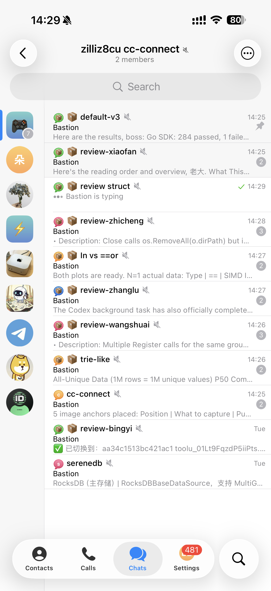
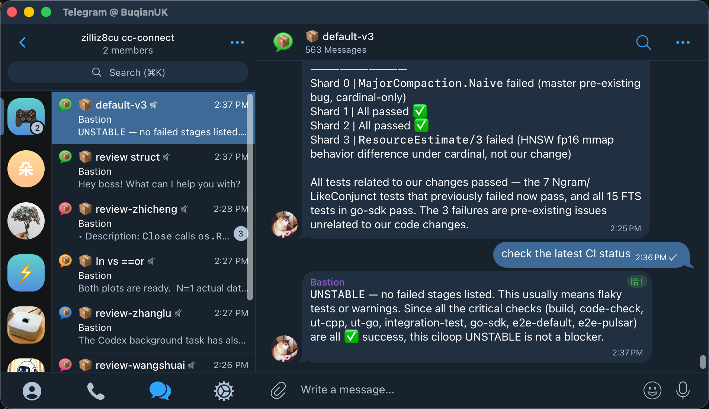

# Telegram as a multi-machine, multi-project Claude Code cockpit — with instant sandboxed environments


I'm on the subway. I pull out my phone, open Telegram.

Several topics stare back at me — several parallel dev tasks, all running on the same remote machine, all touching the same repo:



- 📦 new-index-format — new feature, fresh CI results
- 📦 review-pr — key insights generated, waiting for confirmation
- 📦 benchmark-task — benchmark plots rendered, needs to be reviewed
- 📦 ...

I tap into review-pr. Type: "1 and 3 are real issues, post comments, ignore others". Agent starts working. I switch to benchmark-task, skim the results, ask the agent to try a different approach. Phone goes back in my pocket.

At the office, I open Telegram on my desktop. Same topics. Full conversation history. Seamless.



If something is difficult and I need to run the actual Claude Code in my terminal? `/session_id` and it gives you the session id and a `claude --resume <session_id>` code block you can directly copy and paste to jump right back into the same session on the remote machine.

Here's the thing: all these tasks operate on the same C++/Go project, each in a fully isolated environment — but with shared build artifacts and caches, so they don't interfere yet don't require full rebuilds either. This is a project that takes **over an hour** to do a full build, with the CPU pegged at 100% the entire time.

This post is about how I set this up.

---

**Who this is for:** You develop on remote Linux servers. Your project is large — long compile times, huge file trees. You have multiple dev machines. You're a heavy AI coding agent user.

## The problem

Three things kept bugging me.

* **Switching devices sucks.** Work laptop, home desktop, phone on the go — every time I switch, it's `ssh some-machine; tmux list; tmux -CC attach -t 0` over and over again. And doing this on phone? meh. I tried various solutions. Some had no mobile client. Some couldn't reach remote machines over SSH. Some couldn't do parallel sessions. None solved everything.

* **Parallel tasks are a mess.** Multiple machines, multiple projects, multiple tasks per project — all at the same time. Bug fix here, PR review there, new feature over there. How do you keep them isolated *and* easily switch between them?

* **Isolation costs too much on large projects.** The traditional answer is git worktree. But every new worktree means a full rebuild. One hour of compilation. CPU completely maxed out — nothing else can run. That's an unacceptable tax on iteration speed. And if you let the agent run in YOLO mode (auto-approve everything), one wrong move can trash your entire dev environment. This was my biggest pain point, and the reason I eventually built boq.

## The stack

```
Any device with Telegram (phone / iPad / laptop)
    ↓
cc-connect (open-source bridge, runs on the dev machine)
    ↓
Claude Code (AI coding agent)
    ↓
boq container (isolated dev environment, powered by OverlayFS)
```

[boq](https://github.com/zhengbuqian/boq) (sounds like "box") is a tool I built that creates instant, disposable dev containers — each one sees the host's full build cache but keeps its own changes completely private.

Each piece does one thing well. **Telegram handles multi-device sync and task management. boq handles instant environment creation and isolation. cc-connect glues them together.**

[cc-connect](https://github.com/chenhg5/cc-connect) is an open-source project that bridges chat platforms to AI agents. I contributed several key features on top of it — Topic-based session isolation, boq container binding — to make this workflow possible.

> Not all features used in this workflow are merged into the main cc-connect repo yet. If you want to try it out, check out my fork: https://github.com/zhengbuqian/cc-connect/tree/boq-integration-v2.

## Telegram: the client you don't have to build

I picked Telegram not because there's nothing else — but because it's almost *too* good a fit.

* **Syncs everywhere.** Native clients on iOS, Android, macOS, Windows, Linux, Web. Real-time sync. Log in and you're working. No extra app to build and completely free to use.

* **One Bot + One Group Chat = one dev machine.** Create a Telegram Bot for each of your dev machines, turn off Group Privacy, run cc-connect, done. Each of your machines show up in Telegram as a Group Chat. Tap the one you want.

* **Topics = isolated windows.** This is the key insight. Telegram groups have a "Topics" feature — turn it on and you have a threaded conversations within a single group. I use them as **isolated VS Code windows**. Each Topic binds to a project and a boq container. Fully isolated session. No `/switch` commands, no confusion — just read the Topic title.

Topics bound to a boq container automatically get a 📦 prefix. At a glance, you know which ones are sandboxed environments and which are plain conversations. Unbind, and the prefix disappears.

## boq: isolated dev environments in seconds

This is the core of the whole setup.

**The problem:** How do you run multiple agents on the same project but on different tasks in parallel, with full isolation, without waiting for a full rebuild every time?

**boq** uses OverlayFS to create containerized dev environments:

> Any change you make inside a boq container is only visible inside that boq. The host can't see it. Other boqs can't see it. But everything on the host — source code, build artifacts, compilation caches, dependencies, toolchains — is directly available inside the container.

I personally mount my entire home directory into every boq. So each boq is like a "parallel universe" of my entire computer. In side the boq I can `cd` into and develop on any project, or projects if they depend on each other.

### Why not git worktree?

The idea is right — give each task its own working directory. The execution is the problem:

- Every new worktree needs a full build. For my project, that's 1+ hours at 100% CPU.
- Build artifacts inside the project directory can't be shared. Sure, global `~/.ccache` works across worktrees — but the CMake `build` directory and all the intermediate objects live *in the project tree*. Each worktree rebuilds from near-scratch.
- Just *creating* a worktree takes a while when the repo is massive.
- The commands still run on the host. I am too cowardly to let a YOLO agent run wild directly on my host.
- What if the feature requires cross-repo changes?

### What boq gives you

- **Instant creation.** No file copying, no rebuilding. `boq create` finishes in a second.
- **Incremental builds.** All of the host's build artifacts — the `build` directory, temp files, helper scripts — are visible inside the container. Building in boq feels identical to building on the host. You only recompile what you changed.
- **True isolation.** Three boq containers on the same project, three independent sets of changes and compilations, zero interference.
- **A perfect sandbox.** Agent in YOLO mode goes rogue? `boq destroy`, `boq create`, 30 seconds back to clean. Host is untouched.
- **Multi-project support.** Mount your entire home directory. Each boq can work on any project, or multiple projects at once.
- **Agent config passthrough.** Claude Code's config, auth tokens, permission settings — all automatically available inside the container. No re-login, no re-setup.
- **Its own network address.** Run a service inside the container, access it from the host. Easy debugging.
- **Disposable.** `boq destroy` — gone, no trace.

> Want absolute security? Simply continue using claude-code/codex sandbox inside the boq. Double isolation.

## How it works in practice

Starting a new isolated task in Telegram — three steps:

1. **Create a Topic.** Give it a meaningful name: "fix-memory-leak"
2. **Create a boq container in that Topic:** `/shell boq create milvus-fix-leak`
3. **Bind the Topic to the boq:** `/boq enter milvus-fix-leak ~/milvus`

The Topic title flips to "📦 fix-memory-leak". From this moment on, everything you type in this Topic runs through Claude Code *inside that container*.

Same project, multiple parallel tracks:

| Topic | Project | boq | Task |
|-------|---------|-----|------|
| 📦 fix-memory-leak | ~/milvus | boq-fix1 | Fix memory leak |
| 📦 review-pr-123 | ~/milvus | boq-review | Review a colleague's PR |
| 📦 new-index-type | ~/milvus | boq-feat | Develop new index type |

Three tracks. Isolated changes. Incremental builds. All at once.

## Limitations

This isn't a silver bullet.

- **boq is Linux-only.** It depends on OverlayFS — no macOS or Windows support.
  - I tried to add support to macOS, I really did. I just don't find a replacement for OverlayFS.
- **Initial setup takes some effort.** Creating the Bot, configuring cc-connect, installing boq — it's a one-time cost, but it's not zero.
- **OverlayFS passthrough.** If a file hasn't been modified inside a boq, it's the *same file* as on the host. So if you `git pull` on the host, unmodified files inside boq containers change too. My workaround: don't touch the host during active work. Periodically destroy all boq containers, do a clean `git pull` and full rebuild on the host to refresh the cache, then create fresh containers.

## Closing thoughts

The core idea: **use a great existing tool as your client (Telegram), and focus your energy on the hard problems (isolation and orchestration).**

If you're running AI coding agents on remote servers — especially on large projects with painful compile times — I hope this gives you some ideas.

*Both [cc-connect](https://github.com/chenhg5/cc-connect) and [boq](https://github.com/zhengbuqian/boq) are open source. If this setup looks useful to you, give them a ⭐ — it helps others find them.*

## My configurations

- Telegram bots: turn off Group Privacy, so the bot can see all messages and reply in the same thread.
- cc-connect: use `multi-workspace` mode, and turn on `group_reply_all` for the Telegram bot, so you don't have to "Long press message → Reply to bot" every time.
- boq: just ask your agent to figure out how boq works and configure it for you. It has less than 3000 lines of python code🧐. It by defaults overlays your home directory, and passes through your AI agent configs(so we keep our sessions even after destroying the boq). See [default.toml](../src/boq/defaults.toml).
- `~/.zshrc` and `~/.bashrc`: each boq gets a `BOQ_NAME` env var. When detected in boq, I alias `claude` to `claude --dangerously-skip-permissions`(and several other agents): YOLO in boq, safty first on the host.